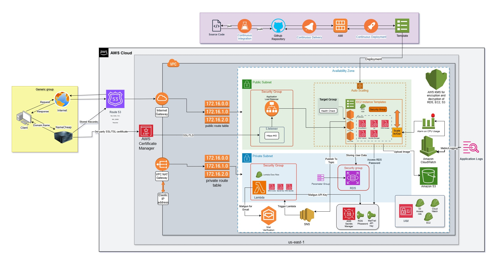

# Infrastructure and Web Application Overview

## Overview
This organization contains three main repositories, each serving a distinct yet integrated purpose in deploying and managing a cloud-based web application:

1. **TF AWS Infra**: Handles the infrastructure setup using Terraform to manage AWS cloud resources.
2. **WebApp**: Contains the Spring Boot web application that runs on the infrastructure provisioned by Terraform.
3. **Serverless**: Handles event-driven computing for email verification using AWS Lambda and SendGrid API.

**Infrastructure Architecture**

## Repositories

### 1. **TF AWS Infra** [Link](https://github.com/cloud-computing-csye-6225/tf-aws-infra)
The **TF AWS Infra** repository is dedicated to managing the cloud infrastructure required to run the CSYE 6225 web application. Using Infrastructure as Code (IaC) with **Terraform**, this repository automates the deployment of all necessary AWS resources, including:

- **Network Configuration**: Creates a Virtual Private Cloud (VPC) with public and private subnets.
- **Security**: Defines security groups for both web applications and databases, ensuring controlled access to services.
- **Compute Resources**: Deploys EC2 instances with custom AMIs tailored to run the web application.
- **Database**: Sets up a MySQL database hosted on Amazon RDS with secure network configurations.
- **Load Balancing and Routing**: Configures route tables, internet gateways, and load balancers for traffic management.
- **Auto Scaling Groups**: The EC2 resources are later replaced with the templates that are used to deploy the EC2 instances using ASG where the up-scaling and down-scaling depends on the CPU Utilization metrics.
- **CloudWatch Monitoring**: Implemented the CloudWatch monitoring to fetch the logs of the application and the custom metrics for the counter and timer of each API using StatsD.
- **Storage System**: The AWS RDS is used to connect to the private subnet to fetch the data for the application and the S3 storage is used to save the profile pictures of the users.

The goal of this application is to provide a scalable and secure foundation for running cloud-based web applications, enabling automated and repeatable infrastructure deployments.

### 2. **WebApp** [Link](https://github.com/cloud-computing-csye-6225/webapp)
The **WebApp** repository contains the source code for a Spring Boot web application designed to run seamlessly on the AWS infrastructure set up by **TF AWS Infra**. Key features of this repository include:

- **Stateless Web Application**: Implements REST APIs for various functionalities using Spring Boot.
- **Database Integration**: Connects to the MySQL database hosted on Amazon RDS, with dynamic configurations handled through environment variables.
- **Packer Integration**: Utilizes Packer templates to build custom Amazon Machine Images (AMIs) that include the web application and its dependencies.
- **Continuous Integration**: Implements GitHub Actions for code testing, validation, and Packer image creation to ensure the web application is robust and deployment-ready.

This repository is responsible for delivering the application logic and services that interact with the cloud infrastructure set up by **TF AWS Infra**.

### 3. **Serverless** [Link](https://github.com/cloud-computing-csye-6225/serverless)
The **Serverless** repository contains the source code for a Spring-based application designed to run seamlessly on the AWS Lambda set up by **TF AWS Infra**. The lambda function is responsible for fetching the user data passed in the SNS created by **TF AWS Infra** and, based on that data, sending mail to that user from the email ID passed in that data.
- The email is sent to the user using SendGrid.
- This feature is to validate and activate the user as soon as the user clicks the link sent in the mail.

This repository is responsible for activating the user account/validating the email id by using the cloud services provided via **TF AWS Infra**.

By combining Infrastructure as Code with a cloud-native web application and the serverless app, this project demonstrates best practices in scalable and automated cloud deployments using GitHub actions fo CI/CD.# .github
